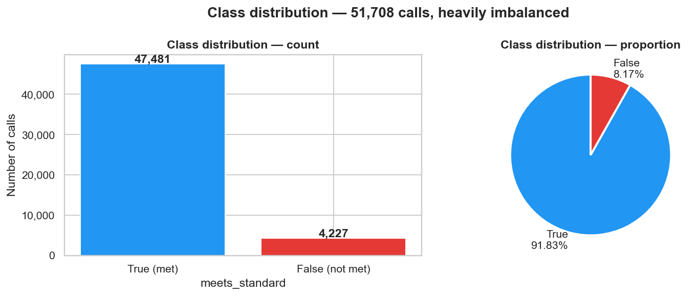

# AI-Based Smart Queue & Time Management System

<p align="center">
  
</p>

<p align="center">
  <a href="#overview"></a>
  <a href="#model"></a>
  <a href="#dataset"></a>
  <a href="#python"></a>
</p>

## Overview

This project builds a feed-forward neural network to predict whether an arriving simulated call will meet a 60-second service standard. The model is designed for the Week 4 assignment in the AI-Based Smart Queue & Time Management System workflow and focuses on operational classification, not time-series forecasting.

The wider vision is a smart queue and time-management system for call centres, where future work may extend into forecasting or scheduling models. This repository concentrates on the classification task required for the assignment.

## Problem statement

A call centre wants to decide whether a newly arriving call is likely to be answered within 60 seconds. This is treated as a binary classification problem:

- `True`: call meets the standard
- `False`: call misses the standard

The main difficulty is class imbalance: the majority of calls meet the service target, while the minority class is the operationally important failure case.

## Dataset

- Source: simulated call-centre queue dataset
- File: `data/simulated_call_centre.csv`
- Shape: 51,708 rows × 9 columns
- Period: 2021-01-01 to 2021-12-31
- Target: `meets_standard`

Selected feature set:

- `daily_caller`
- cyclical time features using sine/cosine encoding
- `day_of_month`
- hour, weekday, and month context derived from the call timestamp

This project intentionally avoids leaking post-arrival information such as `wait_length` and `service_length` into the model.

## Model architecture

The solution uses a TensorFlow/Keras feed-forward neural network with:

- input layer for engineered arrival features
- hidden dense layers with ReLU activation
- sigmoid output layer for binary classification
- binary cross-entropy loss
- Adam optimiser
- class-weight balancing on the training split

The training pipeline uses a chronological 70/15/15 split so the model is evaluated on later demand patterns rather than mixing time periods.

## Experiments and validation

Four experiments were evaluated against the validation set to compare model capacity and regularisation.

| Experiment | Architecture | Learning rate | Best use |
|---|---:|---:|---|
| Baseline | [32] | 0.001 | Simple starting point |
| Increased capacity | [64, 32] | 0.001 | Better learning of nonlinear queue patterns |
| Lower learning rate | [64, 32] | 0.0005 | More stable optimisation |
| Dropout regularisation | [64, 32] | 0.0005 | Regularisation test |

The final evaluation focuses on the minority class (`False`) using precision, recall, and F1-score rather than raw accuracy alone.

## Repository layout

```text
.
├── data/
│   └── simulated_call_centre.csv
├── docs/
│   └── figures/
│       ├── fig1_class_distribution.png
│       ├── fig2_daily_caller_by_target.png
│       ├── fig3_daily_caller_boxplot.png
│       ├── fig4_hour_meet_rate.png
│       ├── fig5_weekday_meet_rate.png
│       ├── fig6_month_volume_rate.png
│       ├── fig7_correlation_heatmap.png
│       ├── fig8_confusion_matrix.png
│       ├── fig9_experiment_comparison.png
│       └── fig_train_exp*.png
├── ml_experiments/
│   ├── nn_classifier.py
│   ├── run_experiments.py
│   └── generate_week4_notebook.py
├── notebooks/
│   └── week4_neural_network.ipynb
├── .gitignore
├── README.md
├── requirements.txt
├── results.json
└── .gitignore
```

## How to run

```bash
pip install -r requirements.txt
python ml_experiments/run_experiments.py
jupyter notebook notebooks/week4_neural_network.ipynb
```

## Key outputs

Generated artifacts include:

- confusion matrix and experiment comparison charts
- training-loss and validation-loss plots
- final model metrics saved in `results.json`
- notebook-based workflow for the assignment deliverable

## Project status

This repository is cleaned to the actual Week 4 classification workflow and is ready for professional GitHub presentation. The project keeps only the data, model code, figures, notebook, and final evaluation outputs needed for the assignment.

## Course / project context

- University: Westcliff University
- Course: TECH 405 — Artificial Neural Network and Deep Learning
- Project: AI-Based Smart Queue & Time Management System

---

This version follows the project’s real scope rather than the earlier exploratory Week 2 files, and it is structured to match the clean GitHub presentation you asked for.
